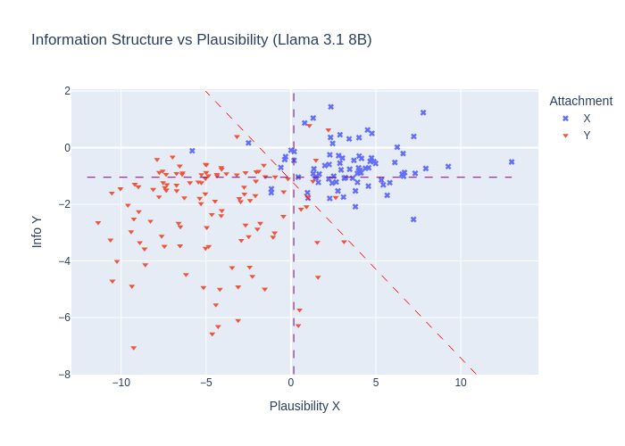

# Can LLMs Disambiguate Grounded Language? The Case of PP Attachment
John Blackmore and Matthew Stone

## TL;DR
This repository contains the code and data for the paper [Can LLMs Disambiguate Grounded Language? The Case of PP Attachment](https://ranlp.org/ranlp2025/index.php/accepted-papers/). 

## Setup
Clone this repo:
```sh
git clone https://github.com/depthfirst/pp-ambiguity.git
```
Build and activate your environment (as necessary):
```sh
cd pp-ambiguity
conda create -n ppa transformers spacy scikit-learn matplotlib plotly
conda activate ppa
```
Install torch and sentencepiece:
```sh
pip install torch sentencepiece
```

Download spaCy model:
```sh
python -m spacy download en_core_web_trf
```

Choose options
```
usage: generator.py [-h] (-i | -f <file> | -s) [-o <file>] -m <model> -p <prompter> [-r <results_dir>]
                    [-t <token>] [--promptcolprefix <pcp>] [-b {svc,default,all}]

options:
  -h, --help            show this help message and exit
  -i, --interactive     Interactive mode
  -f <file>, --input-file <file>
                        Input file
  -s, --sample-mode     Submit sample prompts
  -o <file>, --output-file <file>
                        Output file
  -m <model>, --model <model>
                        Model to use (llama3, vera)
  -p <prompter>, --prompter <prompter>
                        Prompter to use (raw, here, herenorm, there, this, orig)
  -r <results_dir>, --results_dir <results_dir>
                        Directory for results files (jsonlines and html)
  -t <token>, --token <token>
                        Which token to use for probabilities (first,last, period, p2z)
  --promptcolprefix <pcp>
                        Columns named <pcp>_x, <pcp>_y
  -b {svc,default,all}, --boundary {svc,default,all}
```

Run ```generator.py```

Example:
```
python src/generator.py -m llama3 -p dual -t p2zperiod -f data/dev-matters.csv -o ../results/dev-matters-llama3-dual-p2zperiod.jsonlines --promptcolprefix pe
```
Resulting Plot:


